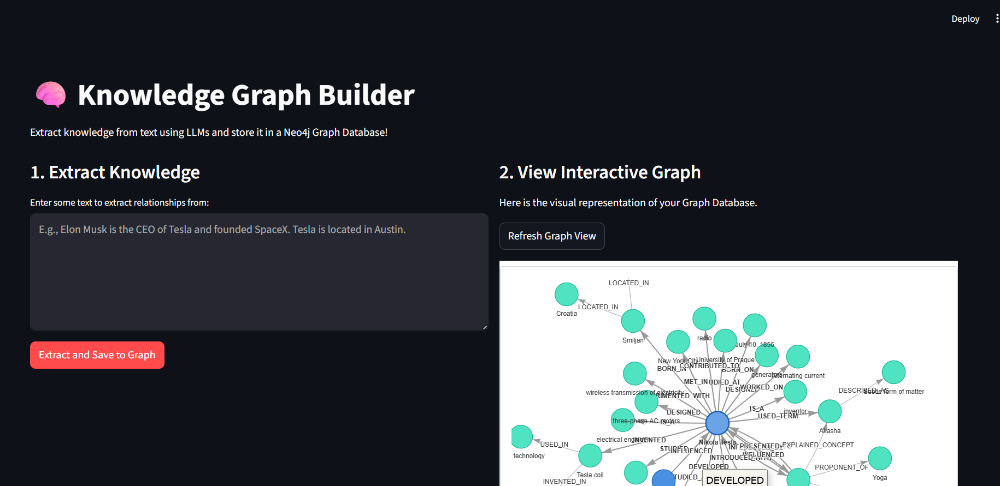
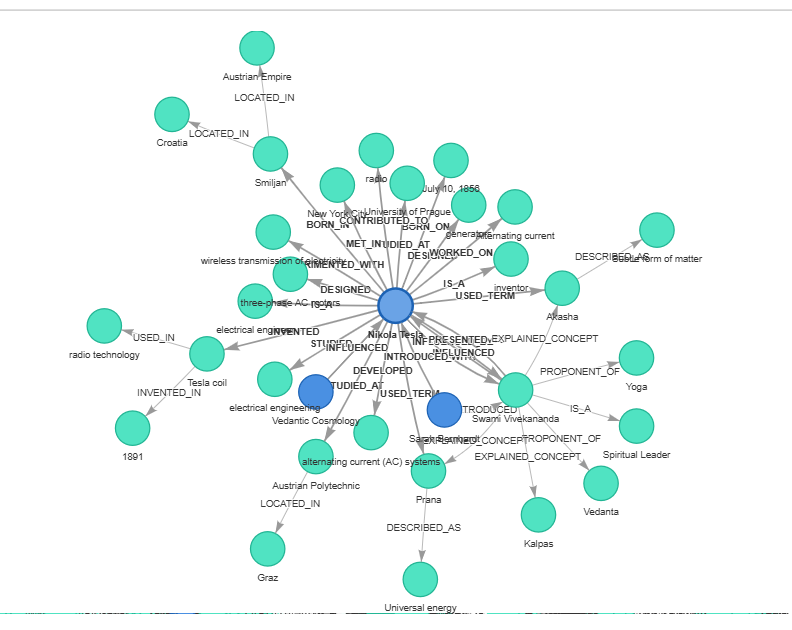

# 🧠 OpenKnowledge: Graph Builder



OpenKnowledge is an intelligent web application that automatically reads unstructured text, extracts meaningful relationships, and builds a fully interactive Knowledge Graph. 

By combining the natural language understanding of Large Language Models (LLMs) with the power of Graph Databases, this tool allows you to effortlessly map out networks of people, places, concepts, and companies just by typing!

---

## 💡 How It Works

The architecture follows a simple but powerful pipeline:

1. **User Input:** You paste raw text (like a news article or a sentence) into the Streamlit UI.
2. **Information Extraction (OpenAI):** The application sends your text to an LLM (like GPT-4o) with strict instructions to perform Named Entity Recognition (NER) and Relation Extraction. It identifies the "Subject", "Predicate" (Relationship), and "Object".
3. **Graph Storage (Neo4j):** The extracted triples (e.g., `Elon Musk` → `CEO_OF` → `Tesla`) are sent to a Neo4j database using Cypher `MERGE` queries to prevent duplicates.
4. **Interactive Visualization (PyVis):** The Streamlit UI queries the Neo4j database to fetch all saved relationships and renders a beautiful, physics-based, interactive network graph directly in your browser.

---

## 📂 Project Structure

```text
OpenKnowledge/
├── app.py               # The main Streamlit web application & UI
├── graph_db.py          # Handles all connections and queries to the Neo4j Database
├── llm_extractor.py     # Connects to OpenAI to parse text into JSON graph relations
├── requirements.txt     # Python package dependencies
├── .env.example         # Template for environment variables
└── README.md            # This documentation file
```

---

## 🚀 Getting Started

### Prerequisites
- **Python 3.8+**
- **Docker** (to run the Neo4j database locally) OR a free [Neo4j AuraDB](https://neo4j.com/cloud/platform/aura-graph-database/) cloud account.
- **OpenAI API Key** (or any OpenAI-compatible API key).

### 1. Set Up the Environment
Clone or navigate to the project directory, then create a virtual environment:

```bash
python -m venv venv

# On Windows:
.\venv\Scripts\activate
# On Mac/Linux:
source venv/bin/activate

# Install the required packages
pip install -r requirements.txt
```

### 2. Configure Environment Variables
Copy the `.env.example` file and rename it to `.env`:
```bash
cp .env.example .env
```
Open the `.env` file and fill in your details:
- `OPENAI_API_KEY`: Your LLM API key.
- `OPENAI_MODEL_NAME`: e.g., `gpt-4o` or `gpt-3.5-turbo`.
- Ensure your `NEO4J_URI`, `USERNAME`, and `PASSWORD` are correct (the defaults work perfectly for the Docker setup below).

### 3. Start the Database
The easiest way to get the Graph Database running is via Docker:
```bash
docker run -d --name neo4j -p 7474:7474 -p 7687:7687 -e NEO4J_AUTH=neo4j/password neo4j:latest
```

### 4. Run the App
Launch the Streamlit interface:
```bash
streamlit run app.py
```
Open the URL provided in the terminal (usually `http://localhost:8501`).

---

## 🎮 Usage Guide

1. **Extract Knowledge:** On the left panel of the web app, type a sentence like *"Apple was founded by Steve Jobs and Steve Wozniak in Cupertino."*
2. **Save:** Click **"Extract and Save to Graph"**. You will see the raw JSON data extracted by the LLM.
3. **Visualize:** On the right panel, click **"Refresh Graph View"** to see your brand new nodes and connections appear as floating, interactive bubbles!


